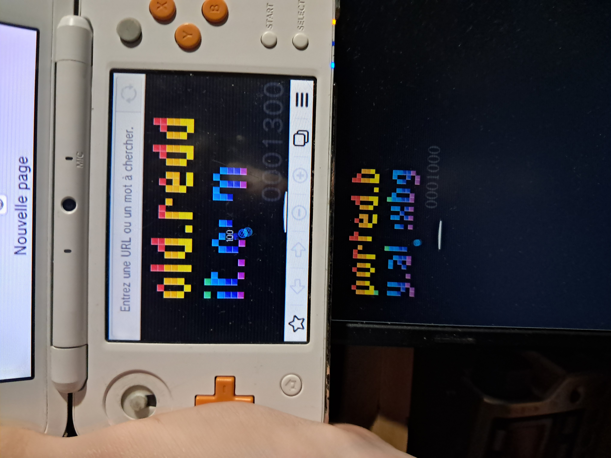

# Hidden Breakout game from 3DS browser ported to PC and Mobile
### So as you may already know, the 3DS web browser have a built-in hidden game of Breakout, but did you know that this is just a little Javascript game?

It's located into the Web Browser app, exactly at this path:

**------------------------------------------------**
### romfs:/browser/page/e.js
**------------------------------------------------**

The input handler in the script uses the gamepad API of the 3DS (called *"navigator.webkitGetGamepads()"*) so i had to rewrite it to use the keyboard on PC
and because it uses the touchscreen of the console too it works for mobile users!

#### You can try it with [this link](https://atexbg.github.io/breakout-3ds-browser/)

